# Week5 Assignment

## Task 2: Create database and table in your MySQL server
```sql
CREATE TABLE member(
id INT UNSIGNED NOT NULL AUTO_INCREMENT,
name VARCHAR(255) NOT NULL,
email VARCHAR(255) NOT NULL,
password VARCHAR(255) NOT NULL,
follower_count INT UNSIGNED NOT NULL DEFAULT 0,
time DATETIME NOT NULL DEFAULT CURRENT_TIMESTAMP,
PRIMARY KEY (id)
);
```
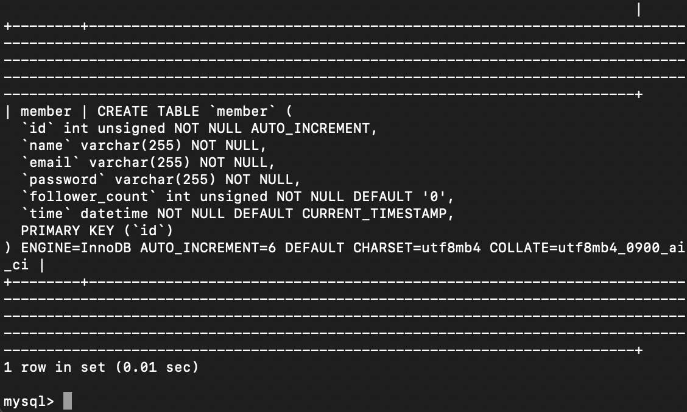

## Task 3: SQL CRUD

### Task 3.1
```sql
INSERT INTO member(name, email, password, follower_count) VALUES
('test', 'test@test.com', 'test'),
('charlene', 'charlene@test.com', 'charlene'),
('airy', 'airy@test.com', 'airy'),
('alfie', 'alfie@test.com', 'alfie'),
('tommy', 'tommy@test.com', 'tommy');
```
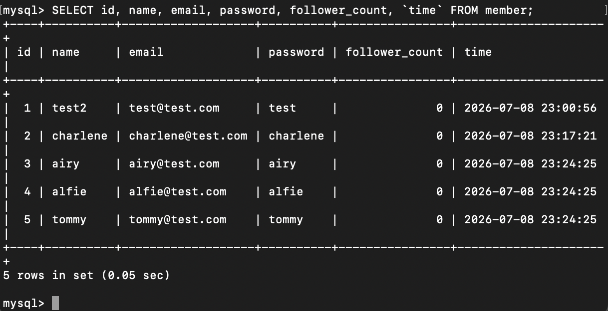

### Task 3.2
```sql
SELECT id, name, email, password, follower_count, `time` FROM member;
```


### Task 3.3
```sql
SELECT id, name, email, follower_count, `time`
FROM member
ORDER BY `time` DESC;
```
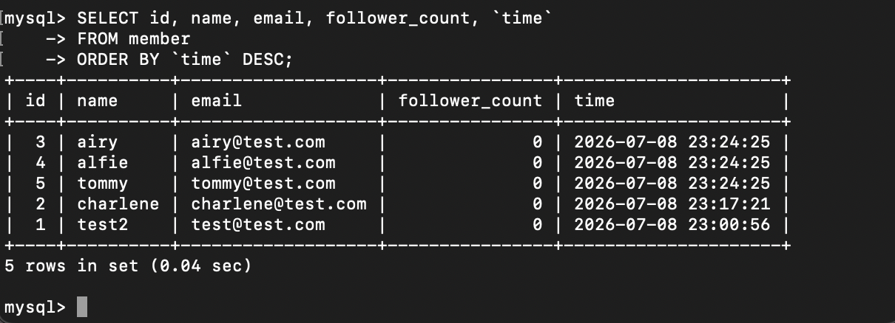

### Task 3.4
```sql
SELECT id, name, email, `time`
FROM member
ORDER BY `time` DESC
LIMIT 3 OFFSET 1;
```
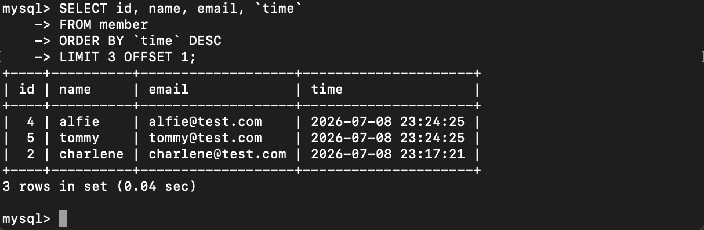

### Task 3.5
```sql
SELECT id, name, email FROM member
WHERE email = 'test@test.com';
```
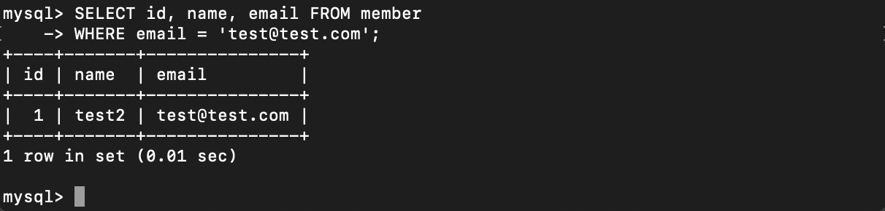

### Task 3.6
```sql
SELECT id, name, email FROM member
WHERE name LIKE '%es%';
```
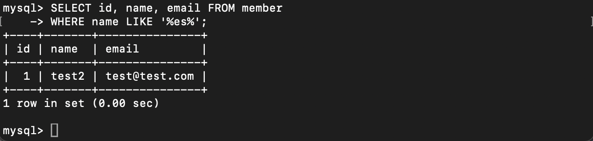

### Task 3.7
```sql
SELECT id, name, email FROM member
WHERE email = 'test@test.com' AND password = 'test';
```


### Task 3.8
```sql
UPDATE member
SET name = 'test2'
WHERE email = 'test@test.com';
```


## Task 4: SQL Aggregation Functions

### Task 4.1
```sql
SELECT COUNT(*) FROM member;
```
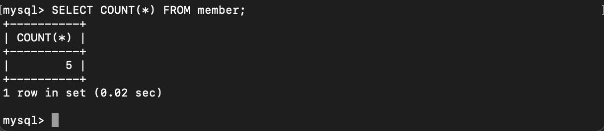

### Task 4.2
```sql
SELECT SUM(follower_count) FROM member;
```
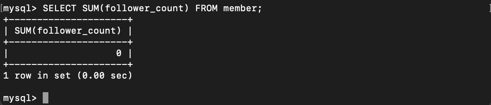

### Task 4.3
```sql
SELECT AVG(follower_count) FROM member;
```
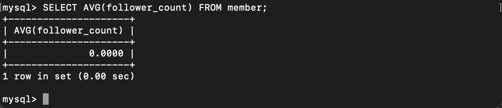

### Task 4.4
```sql
SELECT AVG(follower_count) FROM (
    SELECT follower_count FROM member
    ORDER BY follower_count DESC
    LIMIT 2
) AS top2;
```
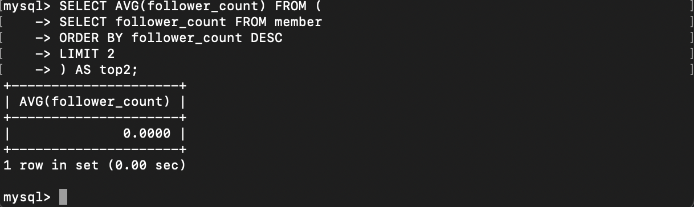

## Task 5: SQU JOIN

### Task 5.1
```sql
CREATE TABLE message (
id INT UNSIGNED  NOT NULL AUTO_INCREMENT,
member_id  INT UNSIGNED  NOT NULL,
content TEXT NOT NULL,
like_count INT UNSIGNED  NOT NULL DEFAULT 0,
`time` DATETIME NOT NULL DEFAULT CURRENT_TIMESTAMP,
PRIMARY KEY (id),
FOREIGN KEY (member_id) REFERENCES member(id)
);
```
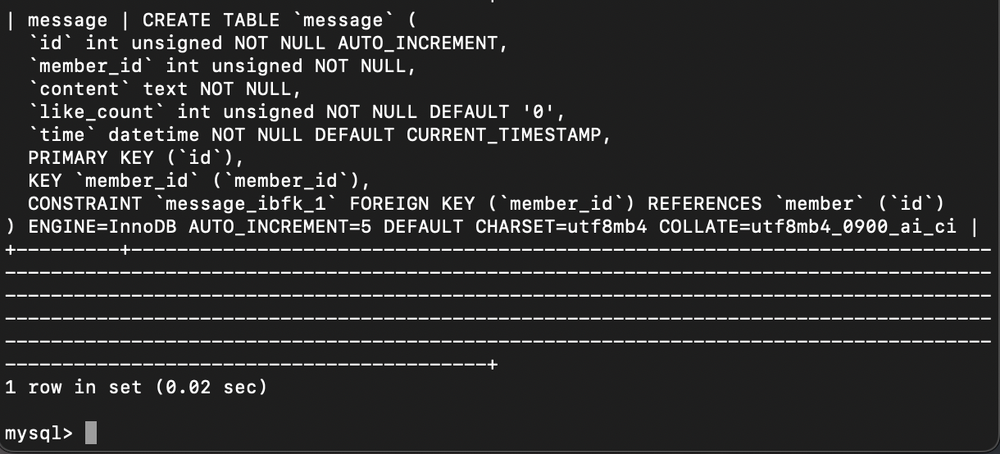

```sql
INSERT INTO message (member_id, content, like_count) VALUES
(1, 'Hello, this is test.', 10),
(1, 'Second post from test.', 20),
(2, 'Charlene says hi.', 5),
(4, 'Alfie posting here.', 8);
```

### Task 5.2
```sql
SELECT message.id, member.name, message.content, message.like_count
FROM message
JOIN member ON message.member_id = member.id;
```
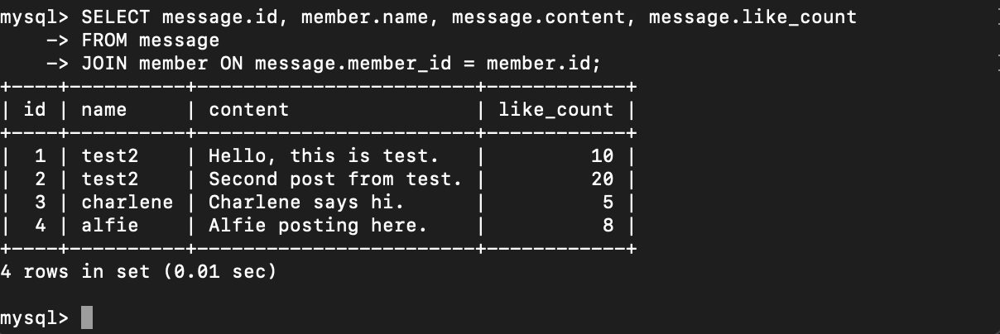

### Task 5.3
```sql
SELECT message.id, member.name, message.content, message.like_count
FROM message
JOIN member ON message.member_id = member.id
WHERE member.email = 'test@test.com';
```
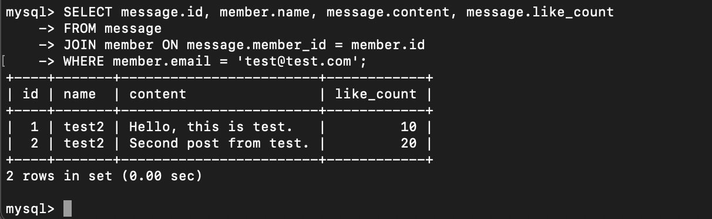

### Task 5.4
```sql
SELECT AVG(message.like_count)
FROM message
JOIN member ON message.member_id = member.id
WHERE member.email = 'test@test.com';
```
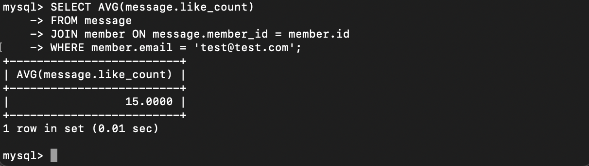

### Task 5.5
```sql
SELECT member.email, AVG(message.like_count)
FROM message
JOIN member ON message.member_id = member.id
GROUP BY member.email;
```
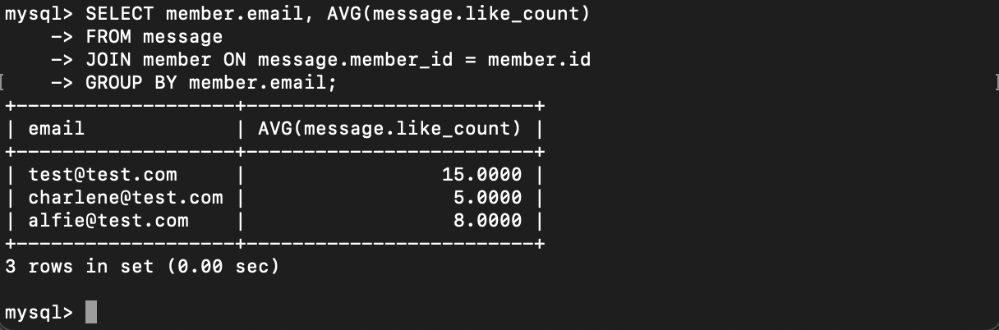
